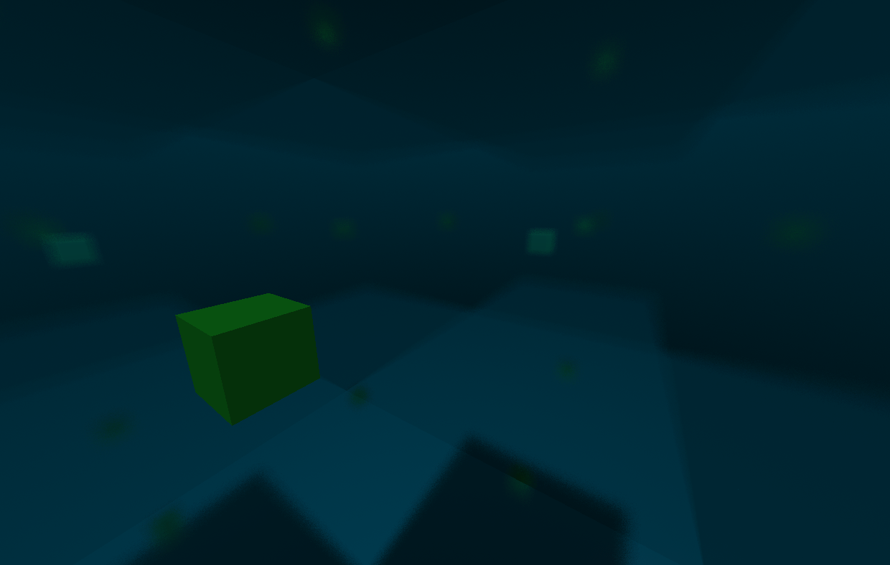
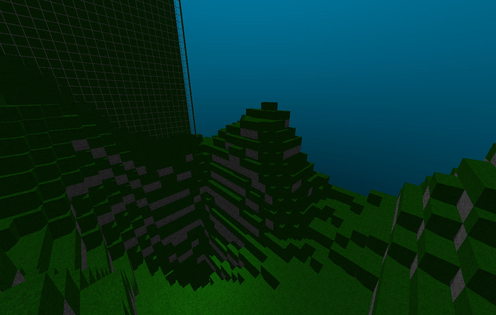

# Voxel RayTracer
This was done as a project for the course [TSKB03](http://computer-graphics.se/TSBK03/) at Linköping University. The project is a voxel raytracer implemented in a GLSL shader. 

## Dependencies 
To run the project a OpenGL shader version of 4.5 is required. If this version is not met, nothing will be shown on screen and error messages will be printed. 
### Ubuntu
Not entirely sure if these work anymore, was a long time since I used Ubuntu. But it atleast gives some hint of what is required.
```
  sudo add-apt-repository ppa:glasen/freetype2
  sudo apt update
  sudo apt install freetype2-demos libfreeimage3 libfreeimage-dev xorg-dev libglew-dev libglfw3-dev
```

### Manjaro 
```
  pamac install freeimage freetype2 glew glfw-x11
```

## Running
To compile and run the application you need to also download my [engine](https://github.com/Thraix/Greet-Engine-Port) (verified to work on engine commit `26da0106fa6172faa74c5ccb562ee654d8656f1c`) and place it in the same directory as this project (ie `~/Documents/VoxelRayTracer` and `~/Documents/Greet-Engine-Port`) then if you use [MakeGen](https://github.com/Thraix/MakeGen) simply run
```
makegen run
```
in the `VoxelRayTracer` directory to run the program.

Otherwise, you first need to build the engine inside `Greet-Engine-Port/Greet-core` by running
```
make
```
then compiling and running the project with
```
make run
```
in the `VoxelRayTracer` directory.

## Using the raytracer
Controlling the raytracer is done with WASD for moving the camera. To rotate the camera you use the arrow keys. To move up and down use the spacebar and left shift respectivly.

Other controls are listed in the GUI of the application.

Sometimes when using the GUI the 3D-scene loses its focus, therefore sometimes the input stops working for the application. This is solved by simply pressing the viewport of the 3D-scene.

## Modifying the RayTracer
The shader is located in res/shaders/voxel.glsl. This contains both the fragment shader and the vertex shader. To render the scene with only colors simply remove the comment of the `#define _COLOR_ONLY`.

In order to change the voxels in the scen you have to modify the src/main.cpp file. There are defines for different scenes located at the top of the file, including `_GLAS_CUBE`, `_TERRAIN` and `_REFRACTION`. There is also a `_HIGH_PERFORMANCE` flag which will render the scene in a framebuffer with size 400x400. This also forces the use of 16x16 size textures, as opposed to 128x128 texture which are used by default.

## Screenshots
### Reflection


### Refraction


### Terrain Scene 

